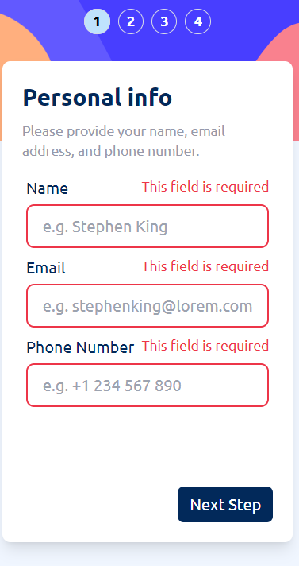

# Frontend Mentor - Multi-step form solution

This is a solution to the [Multi-step form challenge on Frontend Mentor](https://www.frontendmentor.io/challenges/multistep-form-YVAnSdqQBJ). Frontend Mentor challenges help you improve your coding skills by building realistic projects.

## Overview

### The challenge

Users should be able to:

- Complete each step of the sequence
- See a summary of their selections on the final step and confirm their order
- View the optimal layout for the interface depending on their device's screen size
- See hover and focus states for all interactive elements on the page

### Screenshot

### Links

- Live Site URL: [https://multi-step-form-woad.vercel.app/](https://multi-step-form-woad.vercel.app/)

## My process

### Built with

- CSS custom properties
- Flexbox
- Mobile-first workflow
- [React](https://reactjs.org/) - JS library
- [Vercel](https://vercel.com/) - React framework
- [Tailwind CSS](https://tailwindcss.com/) - For styles

### Useful resources

- [Formik](https://www.formik.org) - This helped me with the forms.
- [React Router](https://reactrouter.com/en/main) - This was useful to render just the page I needed without much effort needed.
- [Redux-Toolkit](https://redux-toolkit.js.org/) - This helped me to handle the state of the forms trought each step.

## Author

- Frontend Mentor - [@JaacielBriseo](https://www.frontendmentor.io/profile/JaacielBriseo)
